# Laporan Modul 2: Laravel Fundamentasl
**Mata Kuliah:** Workshop Web Lanjut   
**Nama:** Khairatil Aini  
**NIM:** 2024573010031  
**Kelas:**  TI 2C

---

## Abstrak 
- Laporan ini membahas tentang membangun aplikasi laravel yang meliputi routing, middleware, penanganan request/response, controller, view, dan blade templating, dengan menggunakan MVC.
- Tujuan laporan ini adalah untuk mendokumentasi proses pembelajaran dan pemahamin terhadap alur kerja laravel dari request ke response dan melatih untuk membangun aplikasi sederhanan.

---

## 1. Dasar Teori
- MVC adalah singkatan dari model-view-controller, sebuah pola arsitektur perangkat lunak yang digunakan untuk memisahkan concern dalam aplikasih web:
1. Model : Merepresentasikan data dan logika bisnis. Dalam Laravel, biasanya ditangani oleh Eloquent models yang berinteraksi dengan database.
2. View : Menangani lapisan presentasi — yaitu HTML yang ditampilkan kepada pengguna. Laravel menggunakan Blade sebagai template engine untuk view.
3. Controller : Mengatur alur antara model dan view. Controller menerima input dari pengguna (melalui route), memprosesnya (seringkali melibatkan model), dan mengembalikan view atau respons yang sesuai.
- Konsep Routing adalah
Laravel yang mendefinisikan bagaimana aplikasi merespons permintaan (request) yang masuk. Routing memetakan URI ke aksi controller atau closure. Route di Laravel didefinisikan di file routes/web.php untuk permintaan web dan di routes/api.php untuk route API.
- Fungsi Middleware adalah menyediakan mekanisme untuk memfilter permintaan HTTP yang masuk ke aplikasi. Middleware bertindak sebagai lapisan yang berada di antara siklus request dan response.
- Caranya adalah melalui alur kerja yang terstruktur yang menggunakan konsep HTTP dan MVC, seperti mengakses data request, form request, mengembalikan response.
- Controller yang mengatur alur dan logika, sedangkan view mengatur untuk hasil yang di tampilkan. 
- Blade merupakan template engine yang disediakan oleh laravel, dan juga memudahkan dalam penulisan kode HTML.
---

## 2. Langkah-Langkah Praktikum
2.1 Praktikum 1 – Route, Controller, dan Blade View

- Buka projects calculator yang sudah dibuat, lalu buka folder routes dan cari file web.php
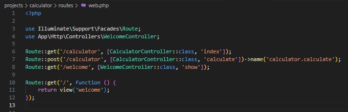

- Buat controller WelcomeController.
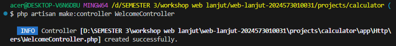

- Buat view mywelcome.blade.php.
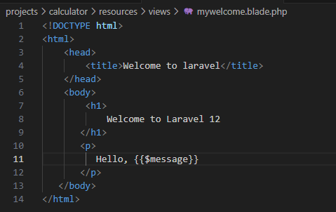

- Jalankan aplikasi dan tunjukkan hasil di browser.
- perintah menjalankan nya
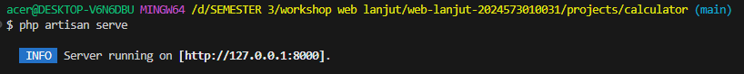
- hasil nya

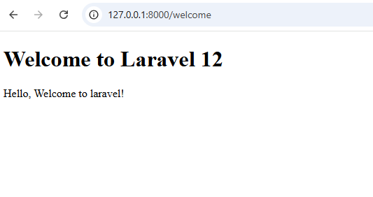

2.2 Praktikum 2 – Membuat Aplikasi Sederhana "Calculator"

- Tambahkan route untuk kalkulator.
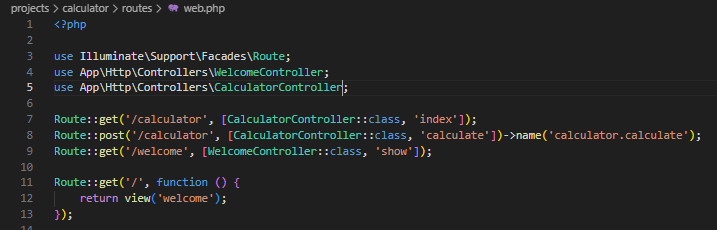

- Buat controller CalculatorController.
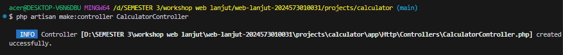

- Tambahkan view calculator.blade.php.
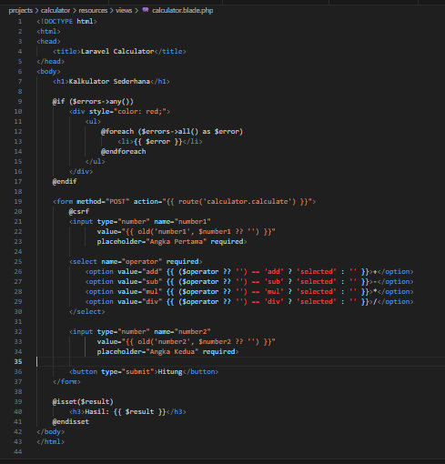

- Jalankan aplikasi dan coba dengan beberapa input berbeda.
- hasilnya calculator
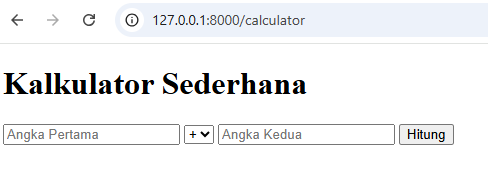
- hasil penjumlahan
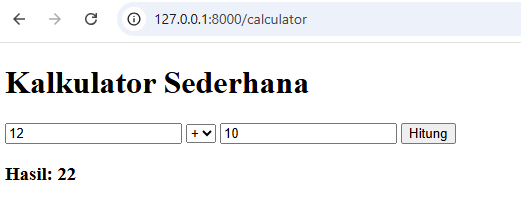
- hasil pengurangan
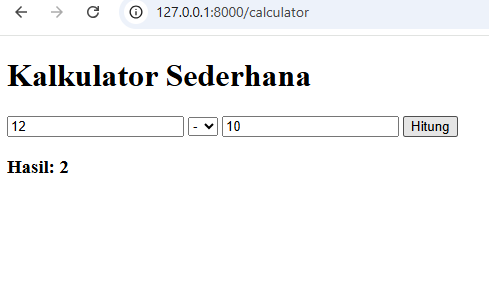
- hasil perkalian
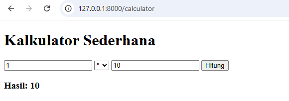
- hasil pembagian

---

## 3. Hasil dan Pembahasan
- iya sesuai harapan saya, tapi dari projects ini saya belajar bawah kesalahan bukan bukanlah hal yang mudah dan kita harus benar- benar memahami di mana salah nya.
- Apa yang terjadi jika ada input yang salah? mengalami error.
- mengirimkan data, Menjalankan validasi dan mengatur validasi.
- 1. Route berfungsi sebagai penghubung
  2. controller berfungsi sebgai logika aplikasi
  3. view berfungsi sebagai tampilan yang di lihat langsung oleh pengguna

---

## 4. Kesimpulan

Dari praktikum ini yang dapat di ambil adalah laravel dengan konsep MVC yang memudahkan pengembangan aplikasi web terstruktur. Route yang menghubungkan URL dengan logika, controller yang mangatur proses aplikasi, dan view yang menampilkan hasil blade. pembuatan aplikasi calculator sederhana yang membuktikan cara laravel menangani input, validasi, dan menampilkan output.

---

## 5. Referensi
1. https://laravel.com/docs
2. https://www.cloudways.com/blog/routing-in-laravel/

---