# Laporan Modul 3: Laravel Controller
**Mata Kuliah:** Workshop Web Lanjut   
**Nama:** KHAIRATIL AINI  
**NIM:** 2024573010031  
**Kelas:** TI 2C 

---

## Abstrak 
- Laporan ini membahas tentang Controller dalam laravel sangat penting untuk manangani logika aplikasi, yang menerima     permintaan dari rute, memproses input, dan mengembalikan respons dan juga ada berbagai jenis controller, cara membuatnya, dan praktik terbaik untuk mengorganisasir logika controller di laravel 12.
- Tujuan laporan ini adalah untuk mendokumentasikan proses pembelajaran dan pemahaman terhadap penggunaan Controller dalam laravel, khususnya dalam menangani alur kerja dari request hingga response.

---

## 1. Dasar Teori
- Controller adalah Dalam pola MVC (Model-View-Controller), sebuah controller bertindak sebagai jembatan antara model dan view. Controller menangani input pengguna, berinteraksi dengan model untuk data, dan mengembalikan respons yang benar, yang seringkali merender sebuah view.
Controller juga menerima permintaan dari pengguna melalui rute (route), memproses input menggunakan logika
 yang diperlukan (termasuk validasi dan interaksi dengan model), lalu mengembalikan hasil berupa tampilan,
 JSON, atau respons lainnya
- Konsep controller di Laravel adalah Controller yang berperan sebagai penghubung antara Model dan View dalam pola arsitektur MVC (Model-View-Controller). Controller bertugas untuk menerima request dari pengguna melalui route, memproses logika aplikasi, berinteraksi dengan model jika diperlukan, dan mengembalikan response berupa tampilan (view) atau data. Dengan adanya controller, logika bisnis aplikasi terpisah dari tampilan sehingga kode menjadi lebih terstruktur, bersih, dan mudah dikelola.
- Fungsi controller adalah Fungsi utama Controller dalam Laravel adalah sebagai pengatur logika aplikasi yang menghubungkan antara route, model, dan view dalam pola arsitektur MVC (Model-View-Controller). 
- Route pada controller adalah Laravel menyediakan fitur Route Grouping untuk mempermudah pengaturan rute yang ditangani oleh satu controller. Dengan menggunakan Route::controller()->group(), beberapa rute dapat digabung dalam satu blok kode tanpa harus menulis controller yang sama berulang kali. Hal ini menerapkan prinsip Don’t Repeat Yourself (DRY) dan membuat struktur rute menjadi lebih efisien serta mudah dibaca. Pengelompokan rute juga membantu dalam pemeliharaan kode saat aplikasi semakin berkembang.
- Request dan response adalah Laravel menangani request dengan mengarahkan setiap permintaan pengguna ke rute yang sesuai. Rute tersebut kemudian meneruskan request ke controller yang bertanggung jawab untuk memproses data, memanggil model jika perlu, dan akhirnya mengembalikan response. Response dapat berupa tampilan HTML, JSON, redirect, maupun teks biasa. Proses ini menunjukkan bagaimana Laravel mengelola komunikasi dua arah antara pengguna dan server secara efisien dan terstruktur.

---

## 2. Langkah-Langkah Praktikum
Tuliskan langkah-langkah yang sudah dilakukan, sertakan potongan kode dan screenshot hasil.

2.1 Praktikum 1 – Menangani Request dan Response View di laravel 12

- Buka projec laravel composer yang sudah dibuat dengan nama lab-view, lalu buat sebuah controller dengan php artisan make:controllerDemoController.
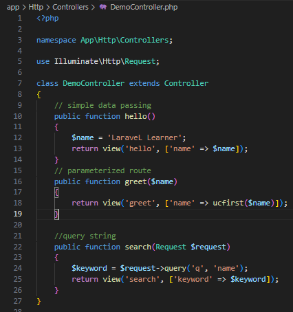

- Tambahkan route pada routes/web.php.
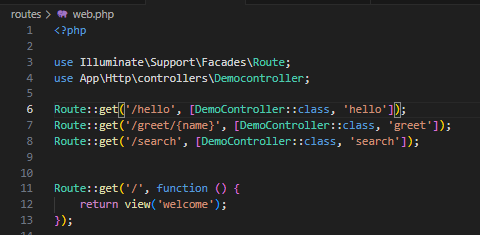

- Buat view sederhana hello.blade.php
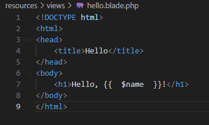

- Buat view sederhana greet.blade.php.
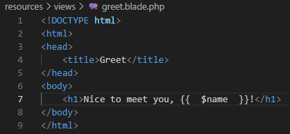

- Buat view sederhana search.blade.php
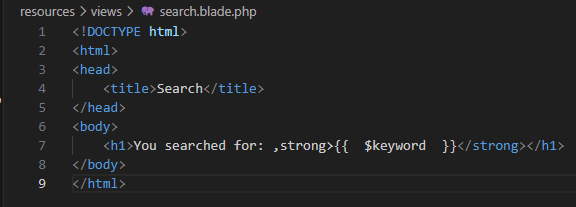

Jalankan aplikasi dan tunjukkan hasil di browser.
- Hasil hello.blade.php 
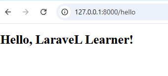

- Hasil greet.blade.php
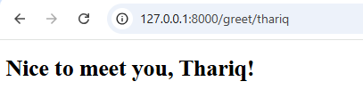

- Hasil search.blade.php
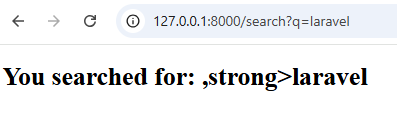

2.2 Praktikum 2 – Menggunakan Group Route

- Tambahkan route untuk web.php
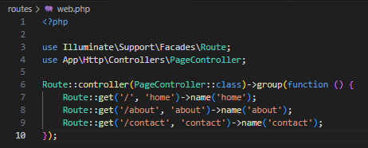

- Buat controller PageController
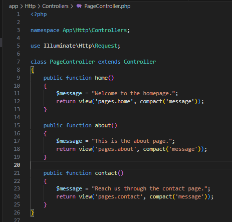

- Tambahkan view home.blade.php didalam folder: resources/views/ lalu tambah folder pages/
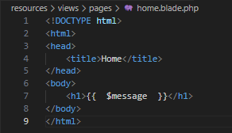

- tambahkan about.blade.php
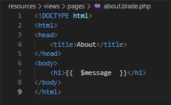

- tambahkan contact.blade.php
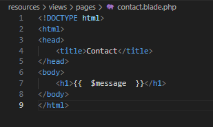

Jalankan aplikasi dan tunjukkan hasil di browser.
- Hasil home.blade.php
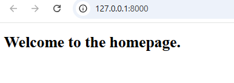

- Hasil about.blade.php
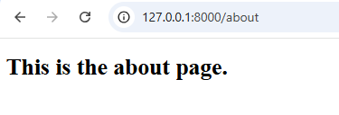

- Hasil contact.blade.php
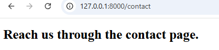

2.3 Praktikum 3 - Pengelompokan Prefix dengan Namespace Rute di laravel 12

- Buat controller dengan Namespace
. php artisan make:controller Admin/DashboardController

. php artisan make:controller Admin/UserController
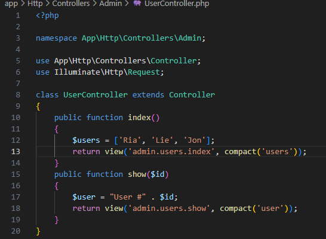

- Tambahkan route untuk web.php
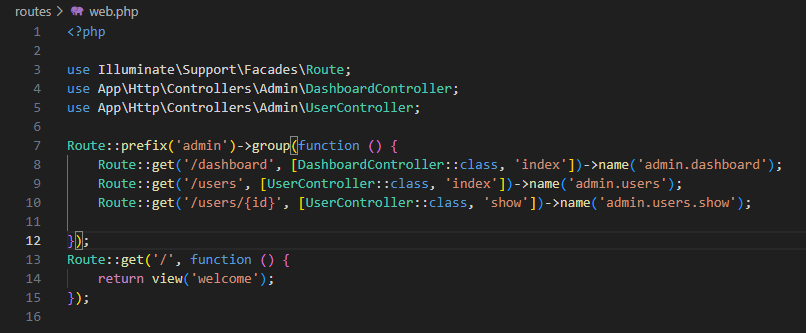

Buat folder dan file dibawah resources/views/admin/. kemudian buat file-file berikut:
- dashboard.blade.php
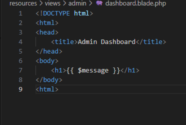

- Tambah folder users dengan file index.blade.php
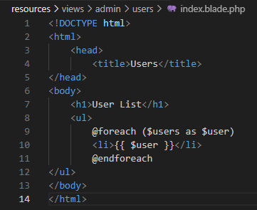

- tambahkan file show.blade.php
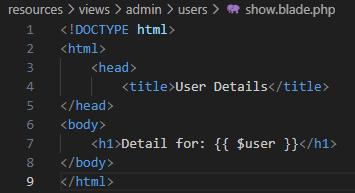

Jalankan aplikasi dan tunjukkan hasil di browser.
- Hasil dashboard.blade.php
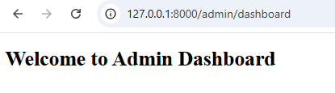

- Hasil index.blade.php
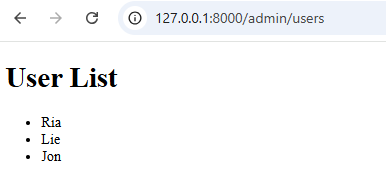

- Hasil show.blade.php
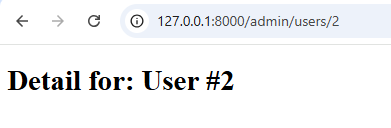

---

## 3. Hasil dan Pembahasan
Dari serangkaian praktikum yang dilakukan pada modul Controller di Laravel 12, diperoleh pemahaman dan hasil nyata tentang bagaimana Laravel mengatur alur kerja antara request, controller, dan view dengan cara yang efisien dan terstruktur.
- Dari praktikum 1 : berhasil membuat controller sederhana democontroller yang menangani request dari pengguna dan mengembalikan response berupa tampilan view.
- praktikum 2 : berhasil dibuat controller dengan beberapa metode (PageController) dan rute yang dikelompokkan menggunakan.
- praktikum 3 : berhasil dibuat controller di dalam sub-namespace Admin (Admin/DashboardController dan Admin/UserController) serta rute dengan prefix admin.
Dari ketiga praktikum tersebut, diperoleh hasil bahwa controller memiliki peran utama dalam mengatur logika dan alur kerja aplikasi Laravel.

---

## 4. Kesimpulan

Kesimpulan dari praktikum modul Controller pada Laravel ini adalah bahwa Controller berperan sangat penting dalam mengatur alur kerja antara request, logika aplikasi, dan tampilan (view). Melalui praktikum yang dilakukan, dipahami bahwa controller berfungsi untuk menerima permintaan dari pengguna, memproses data, dan mengirimkan hasilnya ke view agar dapat ditampilkan di browser. Selain itu, penggunaan route group, prefix, dan namespace membantu dalam mengelompokkan rute dan controller sehingga struktur aplikasi menjadi lebih rapi, efisien, dan mudah dikelola. Dengan memahami konsep controller ini, pengembang dapat membangun aplikasi Laravel yang lebih terorganisir, modular, serta mudah dikembangkan sesuai kebutuhan proyek.

---

## 5. Referensi
1. https://laravel.com/docs/11.x/controllers 
2. https://laravel.com/docs/12.x/routing 

---
