# Laporan Modul 2: Laravel Blade Template Engine
**Mata Kuliah:** Workshop Web Lanjut   
**Nama:** Khairatil Aini 
**NIM:** 2024573010031 
**Kelas:** TI-2C  

---

## Abstrak 
Laporan ini membahas penerapan Blade Template Engine pada framework Laravel, yang berfungsi untuk mengelola tampilan aplikasi web secara efisien dan dinamis.
Tujuan dari pembuatan laporan ini adalah untuk mendokumentasikan hasil pembelajaran dan praktik penggunaan Blade Template Engine di Laravel, memahami konsep dasar serta sintaks yang digunakan, dan melatih kemampuan dalam membangun tampilan web yang rapi, terstruktur, dan mudah dikelola menggunakan sistem templating Laravel.
---

## 1. Dasar Teori
- Blade adalah mesin templating Laravel yang powerful dan sederhana, memungkinkan Anda menulis template yang bersih dan mudah dibaca menggunakan PHP biasa dengan shortcut yang membantu. Fitur Utama:

. Ringan dan cepat
. Mendukung inheritance dan components
. Menyertakan struktur kontrol seperti @if, @foreach, @include

- peran Sintaks dan Direktif Blade adalah Blade Template Engine menyediakan sintaks yang sederhana dan bersih untuk menulis kode PHP di dalam tampilan Laravel. Melalui sintaks seperti {{ $name }}, Blade memungkinkan penulisan variabel secara aman karena Laravel akan otomatis menyaring karakter berbahaya untuk mencegah serangan XSS.
- Blade dan Sections merupakan untuk membuat layout dan section untuk mengatur view yang lebih baik.
- fungsi Blade Components adalah untuk mempermudah pembuatan tampilan yang terstruktur, efisien, dan dapat digunakan kembali.
- Fungsi utama Blade Components adalah untuk membuat elemen tampilan yang dapat digunakan kembali (reusable UI components) sehingga kode menjadi lebih rapi, efisien, dan mudah dikelola.
---

## 2. Langkah-Langkah Praktikum
Tuliskan langkah-langkah yang sudah dilakukan, sertakan potongan kode dan screenshot hasil.

2.1 Praktikum 1 – Meneruskan Data dari Controller ke blade View

1. Buka projec laravel composer yang sudah dibuat dengan nama laravel new madul-4-blade-view cd modul-4-blade-view code. Lalu buat sebuah controller dengan perintah php artisan make:controller DasarBladeController
yang akan membuat App/Http/Controllers DasarBladeController.php
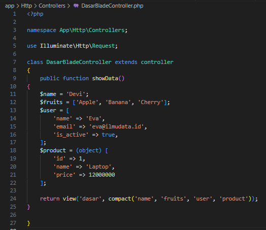

2. Tambahkan route pada routes/web.php.
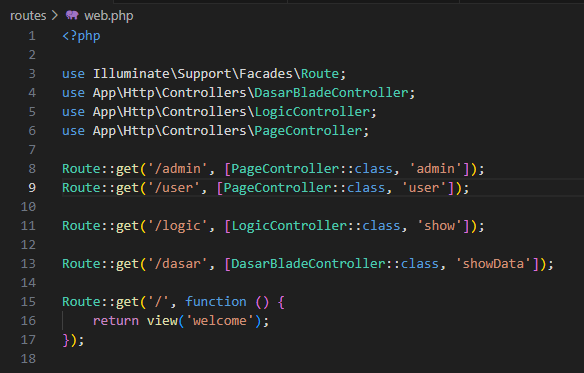

3. Buat blade View, buat file baru di resources/views/dasar>blade.php
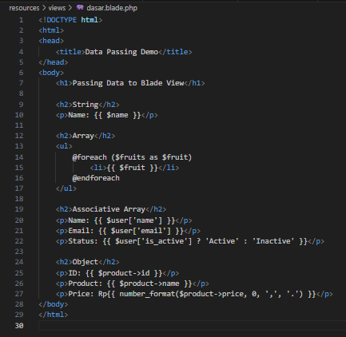

4. Uji rute dengan php artisan serve
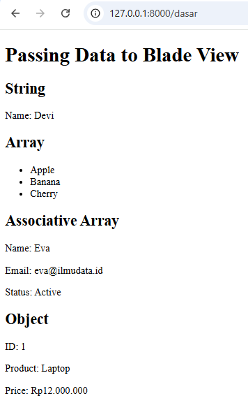

2.2 Praktikum 2 – Menggunakan struktur Kontrol Blade

1. Buat projec controller baru didalam project modul-4-blade-view,  lalu buat sebuah controller baru dengan perintah php artisan make:controller LogicController
yang akan membuat App/Http/Controllers LogicController.php
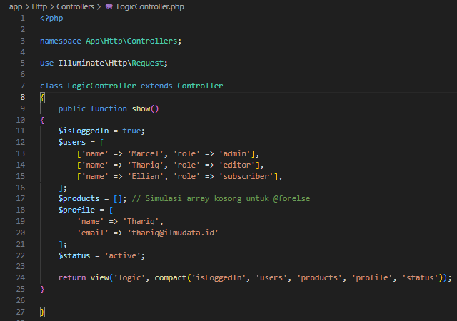

2. Tambahkan route pada routes/web.php.

3. Buat Blade view, buat file view di resources/views/logic.blade.php
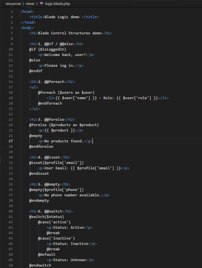

4. jalankan aplikasi dengan perintah php artisan serve
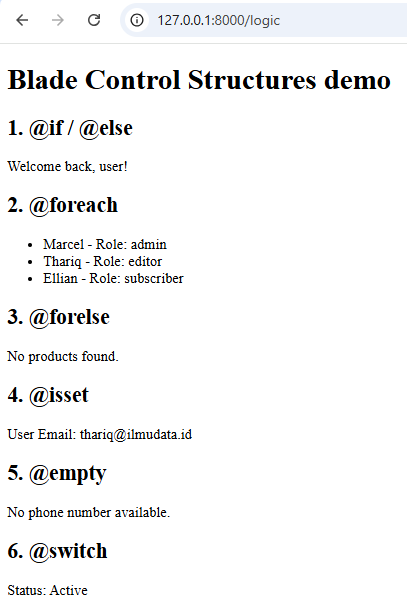

---

2.3 Praktikum 3 – Layout dan Personalisasi di laravel 12 dengan Bootstrap

1. Buat projec controller baru  modul-4-blade-view, lalu buat sebuah controller baru untuk menangani rute dan logika dengan php artisan make:controller PageController
yang akan membuat App/Http/Controllers PageController.php
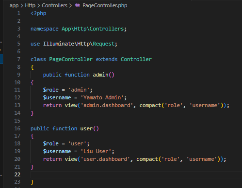

2. Tambahkan route pada routes/web.php.

3. Buat Layout Dasar dengan Bootstrap di dalam rektori di resources/view jika belum ada. kemudian, buat resources/views/layouts/app.blade.php dan isikan denagn kode berikut:
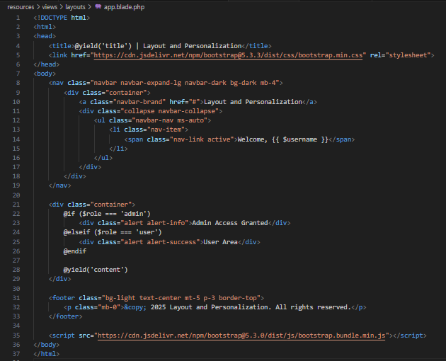

4. Buat view untuk admin, buat direktori admin di resources/views/admin/dashboard.blade.php:
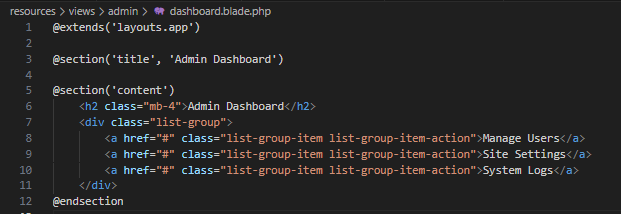

5. Buat view untuk user, buat direktori user di resources/view/user/dashboard.blade.php
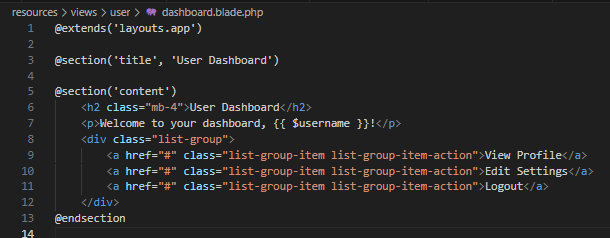

6. jalankan aplikasi dengan perintah php artisan serve
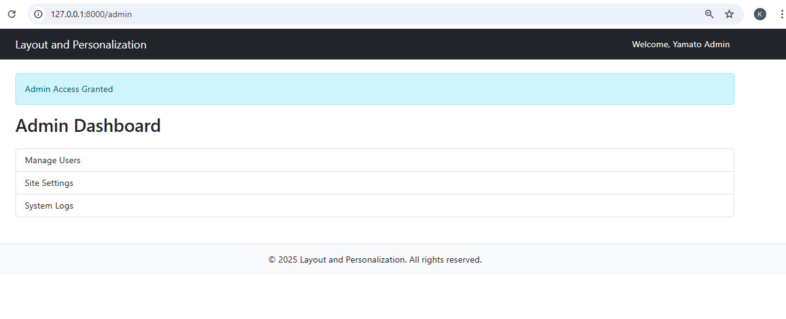
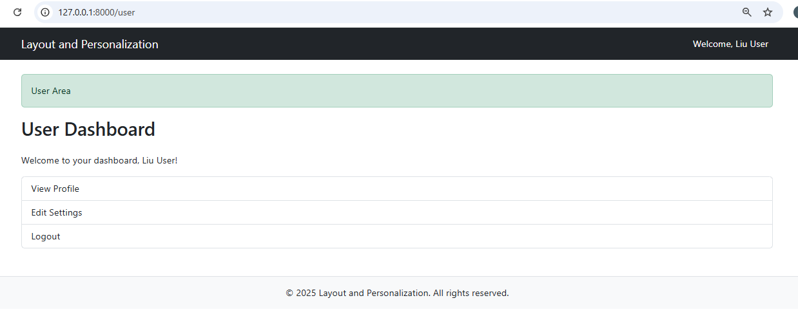

2.4 Praktikum 4 – Partial View, Blade Components, dan Theme Switching di larevel 12

1. Buka projec laravel composer yang sudah dibuat dengan nama laravel new madul-4-laravel-ui cd modul-4-laravel-ui code. Lalu buat sebuah controller dengan perintah php artisan make:controller UIController
yang akan membuat App/Http/Controllers UIController.php
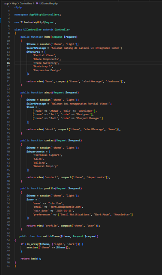

2. Tambahkan route pada routes/web.php.
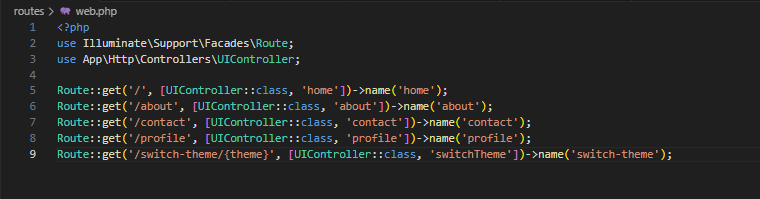

3. Buat Layout utama dengan Theme Support, buat direktori Layout di resources/views/layouts/app.balde.php:

4. Buat Partial View, buat direktori di resources/views/partials/navigation.blade.php
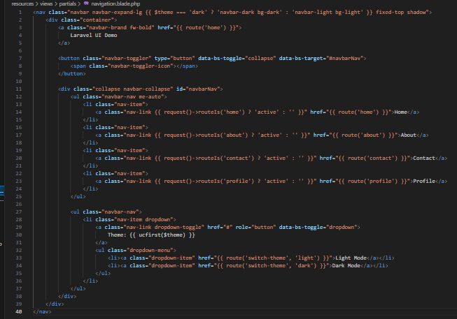

5. Selanjutnya sebuah file, resources/view/partials/alert.blade.php
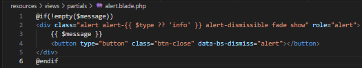

6. Buat Blade Components ketik didalam terminal satu persatu dengan perintah php artisan meke:component footer, php artisan make:component FeatureCard, php artisan make:component TeamMember, 
php artisan make:component ContactForm kemudian edit file resources/views/components/footer.blade.php
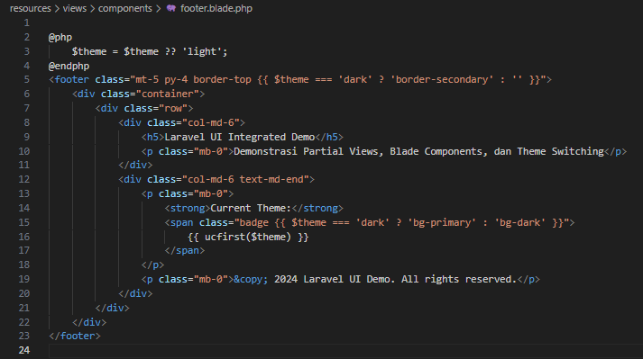
Kemudian, Edit resources/views/components/feature-card.blade.php:
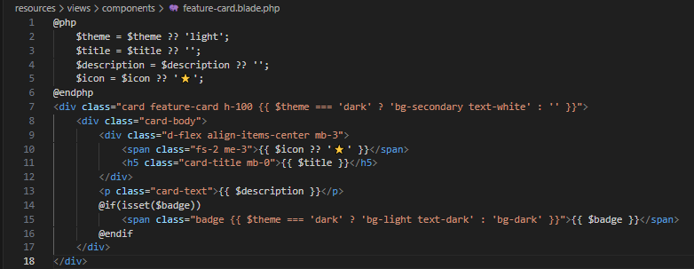
Selanjutnya, Edit resources/views/components/team-member.blade.php:
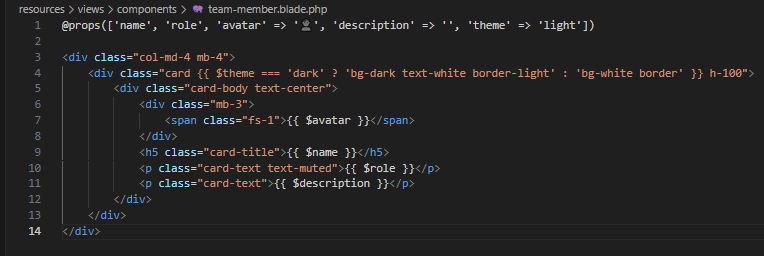

7. Buat Main Views resources/view/home.blade.php
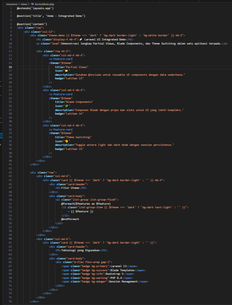
Selanjutnya, buat resources/views/about.blade.php:
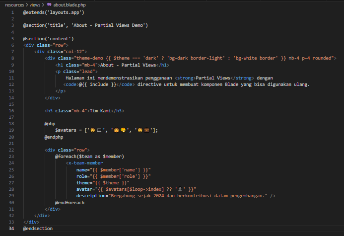
Selanjutnya, buat resources/views/partials/team-stats.blade.php:
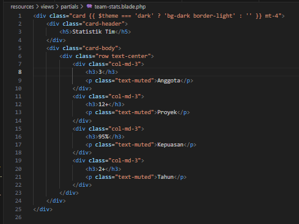
Selanjutnya, buat resources/views/contact.blade.php:

Selanjutnya, Edit resources/views/components/contact-form.blade.php:
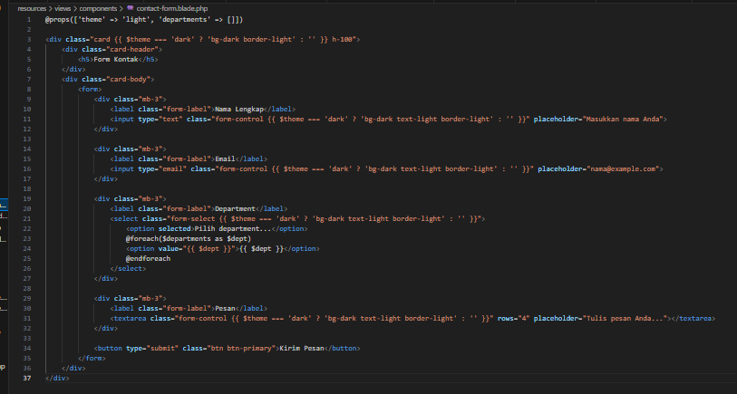
Kemudian, buat resources/views/profile.blade.php:
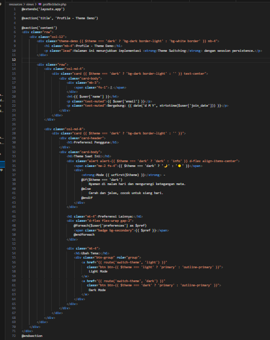

8. jalankan aplikasi dengan perintah php artisan serve
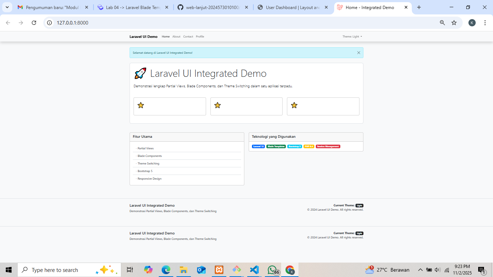
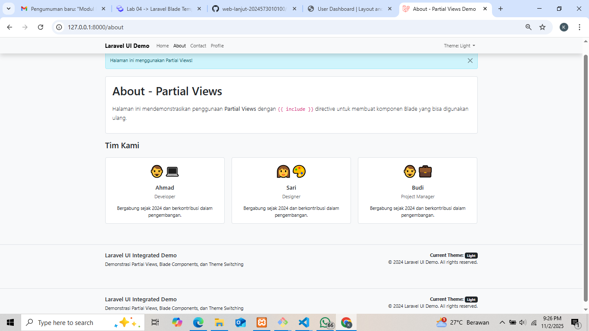
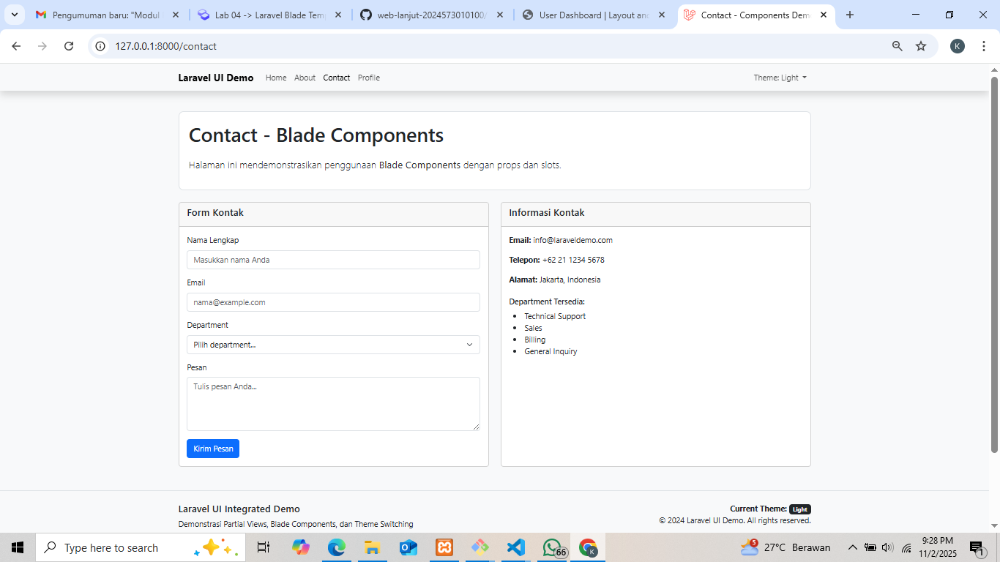
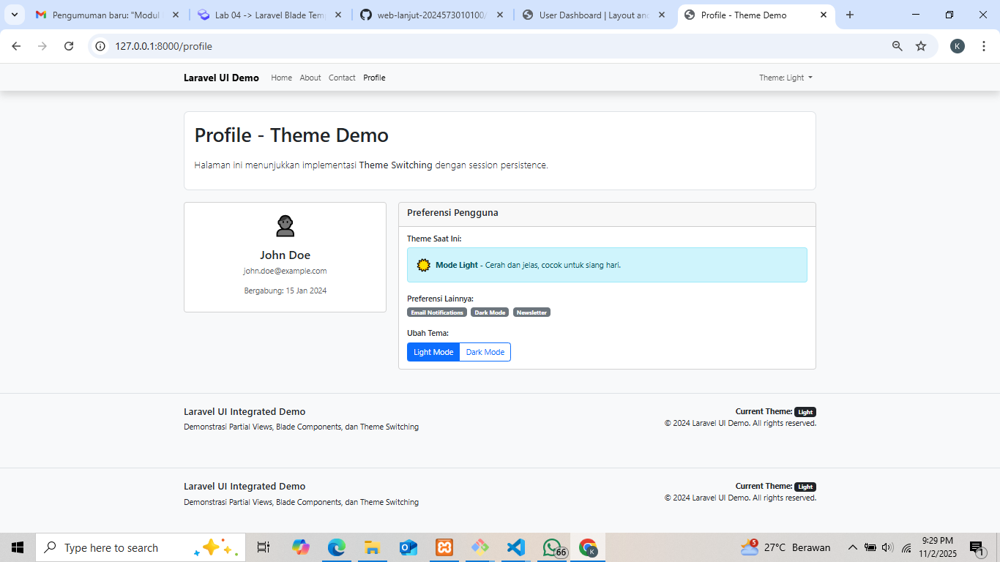

## 3. Hasil dan Pembahasan
Jelaskan apa hasil dari praktikum yang dilakukan.

Berdasarkan hasil praktikum pada modul Laravel Blade Template Engine, diperoleh pemahaman bahwa Blade berperan penting dalam mengatur tampilan aplikasi Laravel agar lebih efisien dan mudah dikelola. Pada praktikum pertama, hasil menunjukkan bahwa data dari controller dapat berhasil ditampilkan di view menggunakan sintaks {{ $variable }}, yang secara otomatis melakukan escaping untuk keamanan data. Praktikum kedua membuktikan bahwa struktur kontrol seperti @if, @else, @foreach, dan @for dapat digunakan untuk mengatur logika tampilan dengan sintaks yang lebih sederhana dibandingkan PHP murni.

Selanjutnya, pada praktikum ketiga, pembuatan layout menggunakan direktif @extends, @section, dan @yield berhasil menunjukkan bagaimana satu tampilan dasar dapat digunakan oleh banyak halaman lain, sehingga mempermudah konsistensi desain. Sedangkan pada praktikum terakhir, pembuatan theme switching memperlihatkan bagaimana Blade dapat dikombinasikan dengan CSS framework seperti Bootstrap untuk menciptakan tampilan antarmuka yang menarik dan interaktif.

Secara keseluruhan, hasil dari modul ini membuktikan bahwa penggunaan Blade Template Engine mampu mempercepat proses pengembangan tampilan web, menjaga kerapian struktur kode, serta meningkatkan efisiensi dan kemudahan dalam pemeliharaan aplikasi Laravel.

---

## 4. Kesimpulan

Dari hasil praktikum yang telah dilakukan, dapat disimpulkan bahwa Blade Template Engine merupakan komponen penting dalam framework Laravel yang berfungsi untuk memisahkan logika dan tampilan agar kode lebih terstruktur, efisien, dan mudah dipelihara. Melalui praktikum, dipelajari cara menampilkan data dari controller ke view, menggunakan struktur kontrol seperti @if dan @foreach, serta menerapkan layout dengan @extends dan @yield untuk menciptakan tampilan yang konsisten di seluruh halaman. Selain itu, penggunaan Blade Components dan theme switching membantu memperkaya tampilan serta meningkatkan pengalaman pengguna. Dengan demikian, pemahaman terhadap Blade Template Engine sangat penting bagi pengembang dalam membangun aplikasi Laravel yang profesional, rapi, dan mudah dikembangkan.

---

## 5. Referensi
1. https://laravel.com/docs/11.x/blade 
2. Sanjaya, D. (2023). Pemrograman Web Framework Laravel untuk Pemula. Yogyakarta: Deepublish Publisher.

---
