# Laporan Modul 5: Form submission & Data Validation
**Mata Kuliah:** Workshop Web Lanjut   
**Nama:** KHAIRATIL AINI  
**NIM:** 2024573010031  
**Kelas:** TI 2C 

---

## Abstrak 
- Laporan ini membahas tentang konsep dasar dan implementasi form submission pada aplikasi web, mulai dari pembuatan form HTML, pengiriman data ke server, hingga proses validasi data baik di sisi client maupun server. Selain itu, laporan ini juga menjelaskan bagaimana menampilkan pesan kesalahan atau konfirmasi setelah proses validasi, serta pentingnya validasi data untuk menjaga keamanan dan keakuratan informasi yang dikirim oleh pengguna.
- Tujuan dari laporan ini adalah untuk memahami dan mempraktikkan cara membuat serta mengelola form pada aplikasi web, termasuk proses pengiriman data (form submission) dan penerapan validasi data untuk memastikan input yang diterima sesuai dengan ketentuan yang diharapkan. Mahasiswa diharapkan mampu membangun form yang interaktif, aman, dan dapat menangani kesalahan input dengan baik.

---

## 1. Dasar Teori
- Form submission dan validasi data merupakan komponen krusial dalam pengembangan aplikasi web modern. Laravel menyediakan sistem yang robust dan elegant untuk menangani input pengguna, memvalidasi data, dan memberikan feedback yang informatif. Sistem ini dirancang dengan prinsip keamanan, kemudahan penggunaan, dan fleksibilitas.
1. Arsitektur Request-Response
Form submission di Laravel mengikuti arsitektur MVC dimana:
- View menampilkan form HTML kepada user 
- Controller menerima dan memproses data yang dikirim
- Model berinteraksi dengan database untuk menyimpan/mengambil data
2. HTTP Methods dalam Form
Laravel mendukung berbagai HTTP methods:
- POST: Mengirim data baru (create)
- PUT/PATCH: Mengupdate data existing
- DELETE: Menghapus data
- GET: Mengambil data (tidak untuk form submission)
Karena HTML form hanya mendukung GET dan POST, Laravel menggunakan method spoofing dengan @method('PUT') untuk simulasi HTTP methods lain.
3. Lifecycle Form Submission
- User mengisi form dan menekan submit
- Browser mengirim HTTP request ke route yang ditentukan
- Middleware memproses request (termasuk CSRF verification)
- Route mengarahkan ke controller method
- Controller memvalidasi data
- Jika valid: data diproses, jika tidak: error dikembalikan
- Response dikirim kembali ke user
4. CSRF Protection
Cross-Site Request Forgery adalah serangan dimana attacker mengelabui user untuk melakukan aksi yang tidak diinginkan pada aplikasi dimana mereka sudah terautentikasi.
---

## 2. Langkah-Langkah Praktikum
Tuliskan langkah-langkah yang sudah dilakukan, sertakan potongan kode dan screenshot hasil.

2.1 Praktikum 1 – Menangani Request dan Response View di laravel 12

- Buka projec laravel composer yang sudah dibuat dengan nama form-app, lalu buat sebuah controller dengan php artisan make:controller FormController.
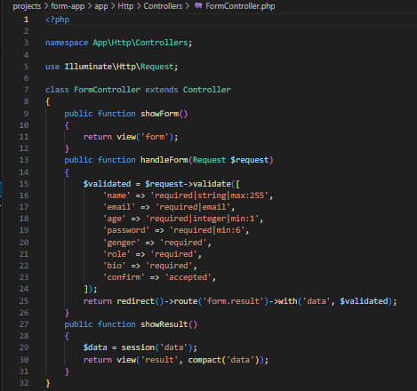

- Tambahkan route pada routes/web.php.
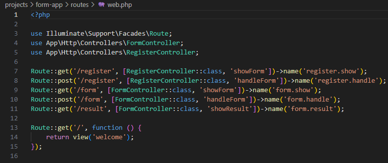

- Buat view Form form.blade.php
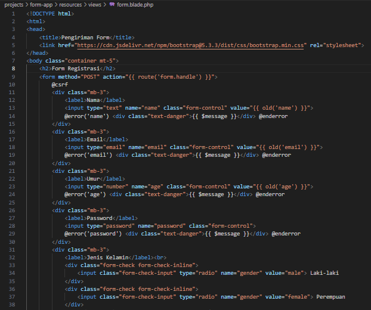

- Buat view Hasil result.blade.php.
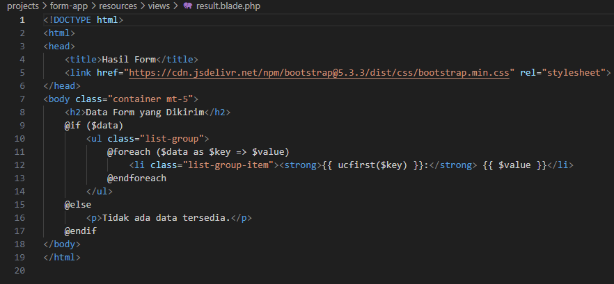

Jalankan aplikasi dan tunjukkan hasil di browser. Dengan menjalankan php artisan serve

- Hasil Form.blade.php
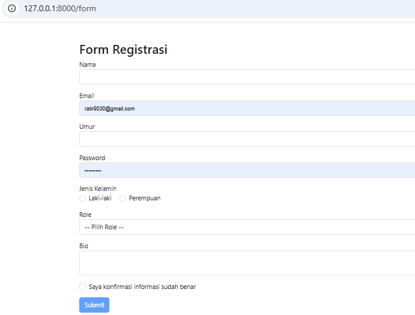

2.2 Praktikum 2 – Validasi Kustom dan Pesan Error di Laravel 12

- Buat controller baru dengan perintah php artisan make;controller RegisterController
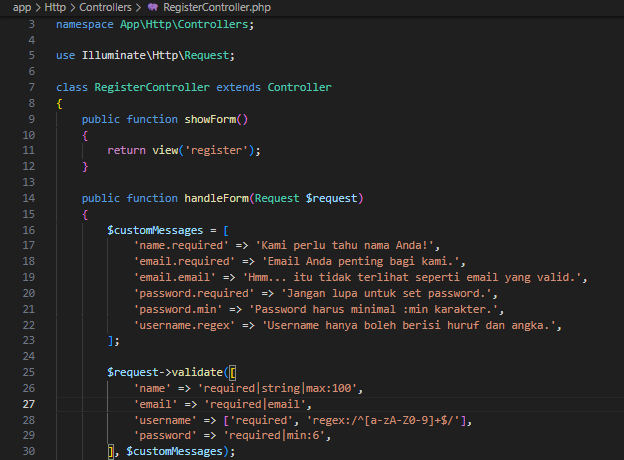

- Tambahkan view register.blade.php didalam folder: resources/views/ lalu tambah folder pages/
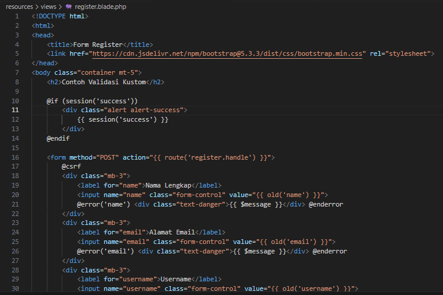

Jalankan aplikasi dan tunjukkan hasil di browser.
- Hasil register.blade.php
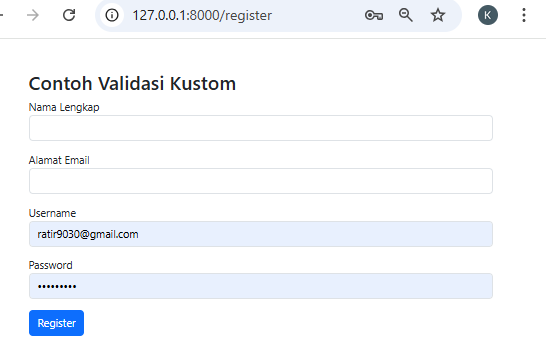

2.3 Praktikum 3 - Multi-Step Form Submission dengan Session Data

- Buat projec laravel composer yang sudah dibuat dengan nama larevel new multistep-form-app, cd multistep-form-app, code .

- Buat Layout Dasar, dengan file layout di resources/views/layouts/app.blade.php
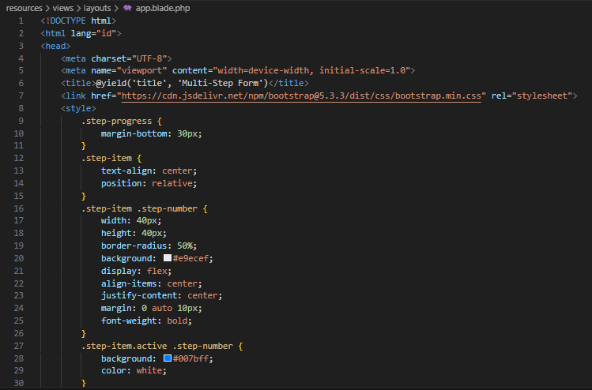

- Tambahkan route untuk web.php
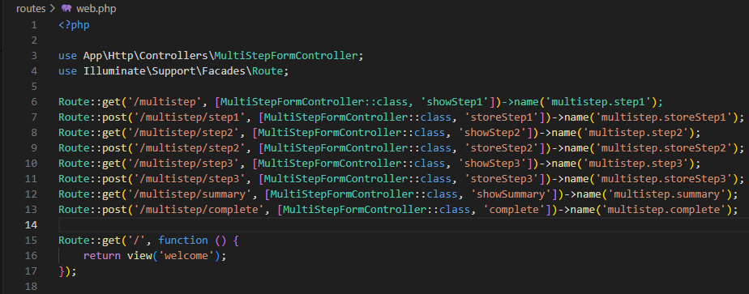

- Buat controller dengan php artisan make:controller multistepformController.
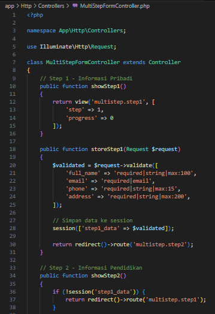

Buat folder dan file dibawah, dengan resources/views/multistep/. kemudian buat file-file berikut:

- Step 1 - Informasi Pribadi:
 resources/views/multistep/step1.blade.php
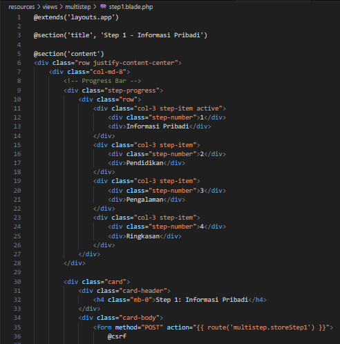

- Step 2 - Informasi Pendidikan:
resources/views/multistep/step2.blade.php
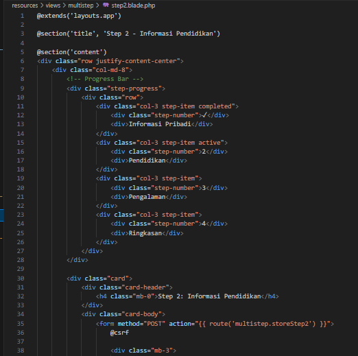

- Step 3 - Pengalaman Kerja:
resources/views/multistep/step3.blade.php
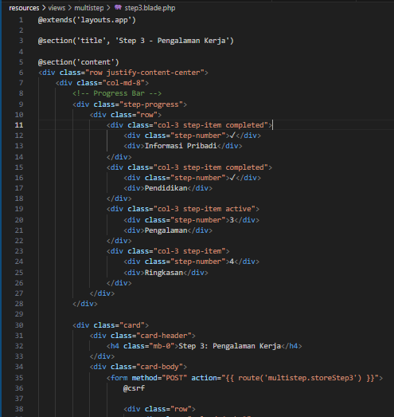

- Summaey - Ringkasan:
resources/views/multistep/summary.blade.php
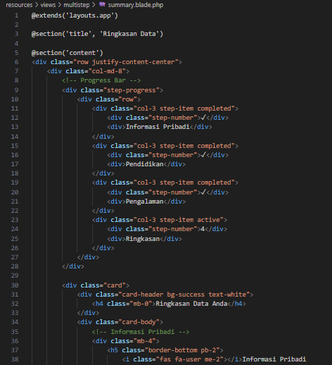

- Complete - Selesai::
resources/views/multistep/complete.blade.php
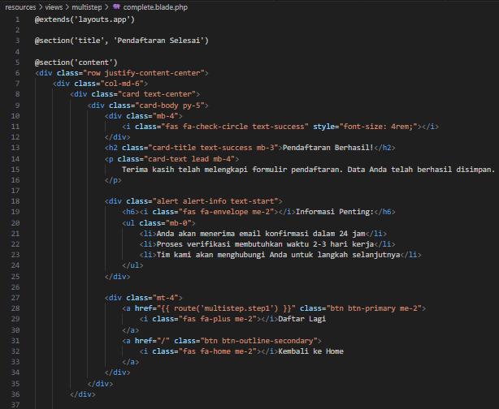

Jalankan aplikasi dan tunjukkan hasil di browser, dengan perintah php artisan serve
- Hasil multistep
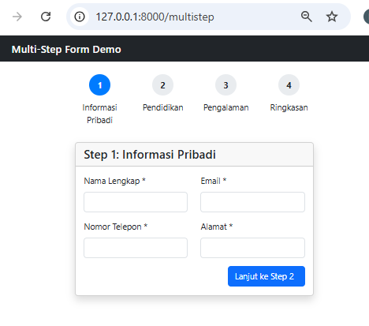

- Kunjungi http://localhost:8000/multistep dan ikuti langkah-langkah form:

Step 1: Isi informasi pribadi (nama, email, telepon, alamat)
Step 2: Isi informasi pendidikan (tingkat pendidikan, institusi, tahun lulus, jurusan)
Step 3: Isi pengalaman kerja (pekerjaan saat ini, perusahaan, pengalaman, keahlian)
Summary: Lihat ringkasan data dan konfirmasi
Complete: Tampilan sukses

---

## 3. Hasil dan Pembahasan
Ketiga praktikum ini membahas cara menangani form, validasi, dan pengelolaan data pada aplikasi web menggunakan Laravel 12. Pada Praktikum 1, pengguna belajar membuat form dengan berbagai jenis input seperti teks, email, angka, dan pilihan, kemudian memvalidasi data agar sesuai aturan sebelum ditampilkan di halaman hasil. Praktikum 2 melanjutkan dengan menambahkan validasi kustom dan pesan error yang lebih ramah pengguna sehingga pengguna mendapat petunjuk yang jelas saat terjadi kesalahan input. Selanjutnya, Praktikum 3 memperkenalkan konsep form bertahap (multi-step form) yang memanfaatkan session untuk menyimpan data di setiap langkah hingga proses pendaftaran selesai. Melalui ketiga praktikum ini, pengguna memahami alur kerja Laravel dalam mengelola request dan response, penggunaan controller untuk logika pemrosesan data, serta penerapan validasi dan session agar aplikasi web menjadi lebih aman, interaktif, dan mudah digunakan.
---

## 4. Kesimpulan

Praktikum ini berhasil mendemonstrasikan pembuatan form registrasi lengkap dengan berbagai tipe input seperti text, email, number, password, radio button, select dropdown, dan textarea. Implementasi validasi server-side menggunakan Laravel's validation rules memastikan data yang dikirim memenuhi kriteria yang ditentukan sebelum diproses lebih lanjut. Fitur interaktif JavaScript untuk mengaktifkan tombol submit hanya ketika checkbox konfirmasi dicentang memberikan pengalaman pengguna yang lebih baik dengan mencegah pengiriman form yang belum diverifikasi. Sistem redirect ke halaman hasil dengan menampilkan data yang berhasil disubmit melengkapi alur kerja form yang smooth dan user-friendly.

Praktikum validasi kustom berhasil menunjukkan fleksibilitas Laravel dalam menangani skenario validasi kompleks dengan pesan error yang lebih informatif dan sesuai konteks, meningkatkan kejelasan komunikasi dengan pengguna. Sedangkan implementasi multi-step form membuktikan kemampuan Laravel dalam mengelola form panjang yang dibagi menjadi beberapa bagian, dengan session management yang efektif untuk menjaga state data antar langkah. Kombinasi progress bar visual, navigasi yang intuitif, dan tampilan ringkasan akhir menciptakan pengalaman pengguna yang terstruktur dan tidak overwhelming, cocok untuk aplikasi seperti pendaftaran pekerjaan, aplikasi kredit, atau proses checkout yang membutuhkan pengumpulan data bertahap.

---

## 5. Referensi
1.  Laravel Documentation — Validation
https://laravel.com/docs/12.x/validation
2. Laravel Documentation — Views (Blade Templates)
https://laravel.com/docs/12.x/blade
3. Raharjo, B. (2022). Pemrograman Web dengan Laravel 9. Bandung: Informatika Bandung.
4. chatgpt.com
---
